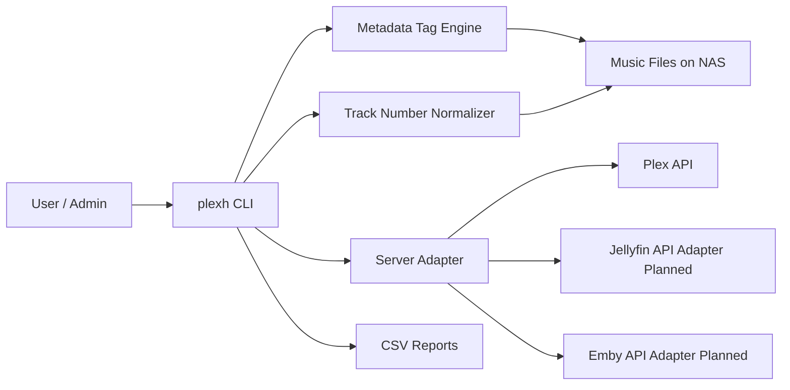
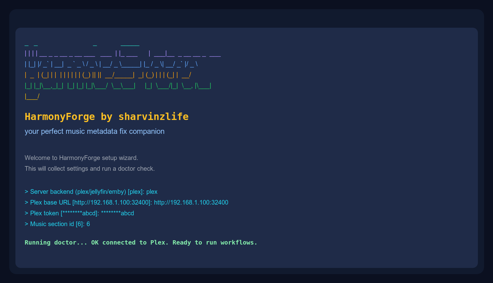

# 🎵 HarmonyForge

<p align="center">
  
</p>

<p align="center">
  
  
  
  
  
  
</p>

<p align="center">
  <strong>🧹 Clean metadata • 🖼️ repair artist covers • 📄 keep audit trails</strong>
</p>

## 🚀 Multi-Purpose Scope
HarmonyForge is built as a media-library hygiene toolkit for **Plex, Jellyfin, and Emby**, with practical workflows for cleanup and long-term organization.

### ✨ Why It Is Useful
1. It removes messy artist buckets like `Various Artists`, `V.A.`, and language variants.
2. It standardizes tags so libraries regroup correctly after scans.
3. It repairs missing/corrupt artist posters.
4. It keeps CSV audit reports so changes are traceable and repeatable.
5. It helps maintain clean albums with correct track numbering tags.

### 🧰 Feature Map
1. **API-driven cleanup (Plex today)**
: `export-artist-tracks`, `cleanup-artists`, `repair-artist-posters`, `verify-artists`
2. **Server-agnostic file-tag hygiene**
: `retag-from-csv` updates `album` and `albumartist` based on target folders
3. **Track numbering correction**
: `fix-track-numbers` reads leading numbers from filenames (for example `01 - Song.flac`) and writes `tracknumber`
4. **Cross-platform execution**
: Linux/macOS/Windows wrappers and CI matrix
5. **Portable project structure**
: reusable scripts, docs, diagrams, and report outputs

### 🔧 Backend Support Status
1. ✅ **Plex API workflows**: implemented
2. ✅ **Jellyfin/Emby file-tag workflows**: implemented (file operations are server-agnostic)
3. 🛠️ **Jellyfin/Emby API adapters**: planned

Use `--server plex|jellyfin|emby` to select backend behavior.

## 🧭 Architecture (Mermaid)


## 🌐 Generic Environment Setup
```bash
export MEDIA_SERVER="plex"
export PLEX_BASE_URL="http://192.168.1.100:32400"
export PLEX_TOKEN="replace-with-your-token"
export PLEX_MUSIC_SECTION="6"
```

PowerShell:
```powershell
$env:MEDIA_SERVER = "plex"
$env:PLEX_BASE_URL = "http://192.168.1.100:32400"
$env:PLEX_TOKEN = "replace-with-your-token"
$env:PLEX_MUSIC_SECTION = "6"
```

## 🔐 Token + Path Setup (Important)
### Is token built into the script?
No. The script does **not** hardcode your token. You pass it at runtime using:
1. environment variable `PLEX_TOKEN`, or
2. CLI flag `--token`.

### How to get your Plex token
1. Open Plex Web in your browser and sign in.
2. Open any library item, click the `...` menu, then `Get Info`.
3. Open `View XML` for that item.
4. In the opened URL, copy the value after `X-Plex-Token=`.

### How to set token
Linux/macOS:
```bash
export PLEX_TOKEN="paste-token-here"
```

Windows PowerShell:
```powershell
$env:PLEX_TOKEN = "paste-token-here"
```

Or pass directly:
```bash
plexh verify-artists --server plex --token "paste-token-here" --show 20
```

### How to set music paths correctly
HarmonyForge uses two path types:
1. **Server path** (what Plex sees): for example `/Music/Artist/Album/01 - Song.flac`
2. **Host/NAS path** (what your shell sees): for example `/mnt/nas/music/Artist/Album/01 - Song.flac`

Use `--path-map` to connect them:
```bash
--path-map "/Music=/mnt/nas/music"
```

For Windows mapped drives:
```powershell
--path-map "/Music=Z:\\Music"
```

### What is `--scan-root-prefix`?
It tells cleanup commands what top-level path Plex scans.
If your Plex library root is `/Music`, use:
```bash
--scan-root-prefix "/Music"
```

### Section ID (`PLEX_MUSIC_SECTION`)
Default is often `6`, but yours may differ. You can pass another value:
```bash
plexh verify-artists --server plex --section 6 --show 20
```

## ⚡ Super Quick Start
```bash
git clone https://github.com/sharvinzlife/HarmonyForge.git
cd HarmonyForge
```

## ⚙️ Install By Platform

### 🐧 Linux (Ubuntu/Debian)
```bash
sudo apt update
sudo apt install -y python3 python3-venv python3-pip
python3 -m venv .venv
source .venv/bin/activate
pip install -e .
```

### 🍎 macOS
```bash
brew install python
python3 -m venv .venv
source .venv/bin/activate
pip install -e .
```

### 🪟 Windows (PowerShell)
```powershell
winget install -e --id Python.Python.3.11
python -m venv .venv
.\.venv\Scripts\Activate.ps1
pip install -e .
```

### 💻 Windows (CMD)
```cmd
python -m venv .venv
.venv\Scripts\activate.bat
pip install -e .
```

## 🛠️ One Command Interface
Interactive startup:
```bash
plexh
```
Running `plexh` with no subcommand opens an interactive wizard with:
1. animated HarmonyForge banner
2. prompts for server URL, token, section, and paths
3. automatic `doctor` validation
4. optional save to `.env.local`

Startup preview:
<p align="center">
  
</p>

After install:
```bash
plexh --help
```

## 🧾 CLI Help
Quick command map:
```text
wizard                 Interactive setup + doctor validation
doctor                 Validate token, section, and path mapping
export-artist-tracks   Export bad artist bucket tracks to CSV
retag-from-csv         Fix album + albumartist tags
fix-track-numbers      Fix tracknumber tags from filename prefixes
cleanup-artists        Delete stale artist shells + trigger rescans
repair-artist-posters  Repair missing/corrupt artist covers
verify-artists         Verify artist poster health summary
```

Help command:
```bash
plexh --help
```

Without install:
- Linux/macOS: `./bin/plexh verify-artists --show 10`
- Windows PowerShell: `.\bin\plexh.ps1 verify-artists --show 10`
- Windows CMD: `bin\plexh.cmd verify-artists --show 10`

## 🩺 Doctor Check (Run First)
Use this before workflow commands to validate token, section, and path mapping.

Linux/macOS:
```bash
plexh doctor --server plex \
  --path-map "/Music=/mnt/nas/music" \
  --scan-root-prefix "/Music"
```

Windows PowerShell:
```powershell
plexh doctor --server plex `
  --path-map "/Music=Z:\\Music" `
  --scan-root-prefix "/Music"
```

Output meaning:
1. `OK` = good
2. `WARN` = can continue, but review settings
3. `FAIL` = fix this before running cleanup

## 📚 Simple Workflow (Easy Version)
Think of this flow as: **find bad items -> fix tags -> clean old artist buckets -> fix covers -> verify**.

### Before you run it
1. `/Music` = the path Plex sees inside the library.
2. `/mnt/nas/music` = the path your terminal sees on disk.
3. If your paths differ, change both `--path-map` values.
4. Run `plexh doctor` first to catch token/path mistakes early.

### Step 0: Create a report folder
```bash
mkdir -p reports
```

### Step 1: Export problem tracks to CSV
What it does: finds tracks currently grouped under bad artist names and writes `reports/targets.csv`.
```bash
plexh export-artist-tracks \
  --server plex \
  --artist-names "Various Artists,V.A.,Verschillende artiesten" \
  --out-csv reports/targets.csv
```

### Step 2: Fix album + albumartist tags
What it does: updates metadata so tracks regroup under clean album names.
```bash
plexh retag-from-csv \
  --server plex \
  --in-csv reports/targets.csv \
  --out-csv reports/retag_report.csv \
  --path-map "/Music=/mnt/nas/music"
```

### Step 3: Fix track numbering tags
What it does: reads track numbers from filenames like `01 - Song.flac` and writes `tracknumber`.
```bash
plexh fix-track-numbers \
  --server plex \
  --in-csv reports/targets.csv \
  --out-csv reports/tracknumber_report.csv \
  --path-map "/Music=/mnt/nas/music" \
  --preserve-total
```

### Step 4: Remove stale artist buckets and rescan
What it does: removes old bad artist shells and refreshes affected folders in Plex.
```bash
plexh cleanup-artists \
  --server plex \
  --artist-names "Various Artists,V.A.,Verschillende artiesten" \
  --scan-csv reports/targets.csv \
  --scan-root-prefix "/Music" \
  --path-map "/Music=/Music" \
  --section-refresh
```

### Step 5: Repair missing/corrupt artist posters
What it does: fills broken or missing artist images from album art/local images.
```bash
plexh repair-artist-posters \
  --server plex \
  --fix-missing --fix-corrupt --generate-missing \
  --path-map "/Music=/mnt/nas/music" \
  --out-csv reports/poster_report.csv
```

### Step 6: Verify final state
What it does: shows remaining missing/corrupt artist posters.
```bash
plexh verify-artists --server plex --show 20
```

### One-line full run
```bash
mkdir -p reports && \
plexh export-artist-tracks --server plex --artist-names "Various Artists,V.A.,Verschillende artiesten" --out-csv reports/targets.csv && \
plexh retag-from-csv --server plex --in-csv reports/targets.csv --out-csv reports/retag_report.csv --path-map "/Music=/mnt/nas/music" && \
plexh fix-track-numbers --server plex --in-csv reports/targets.csv --out-csv reports/tracknumber_report.csv --path-map "/Music=/mnt/nas/music" --preserve-total && \
plexh cleanup-artists --server plex --artist-names "Various Artists,V.A.,Verschillende artiesten" --scan-csv reports/targets.csv --scan-root-prefix "/Music" --path-map "/Music=/Music" --section-refresh && \
plexh repair-artist-posters --server plex --fix-missing --fix-corrupt --generate-missing --path-map "/Music=/mnt/nas/music" --out-csv reports/poster_report.csv && \
plexh verify-artists --server plex --show 20
```

## 🧪 Tests
```bash
PYTHONPATH=src python3 -m unittest discover -s tests -v
```

## 🗂️ Docs
- `docs/architecture.md`
- `docs/quickstart-linux-macos.md`
- `docs/quickstart-windows.md`
- `docs/github-publish.md`
- `docs/name-ideas.md`

## ✅ Persistence Notes
- File tag and folder fixes persist across media server rebuilds.
- Server DB-only poster assignments may need rerun after DB reset.

## ⚠️ Safety
- Start with `retag-from-csv --dry-run` for new libraries.
- Avoid `--empty-trash` unless media deletion is disabled.

---

## 💙 Credits
Made with love by **sharvinzlife**.

[](https://fb.com/sharvinzlife)
[](https://x.com/sharvinzlife)
[](https://instagram.com/sharvinzlife)
