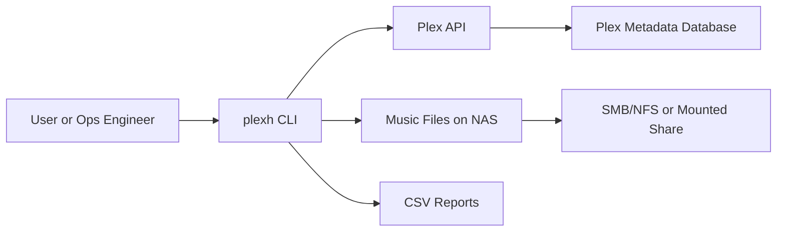

# 🎵 HarmonyForge

<p align="center">
  
</p>

<p align="center">
  
  
  
  
  
</p>

<p align="center">
  <strong>Repair tags. Remove bad artist buckets. Restore artist posters. Keep full audit trails.</strong>
</p>

## 🚀 What It Does
- 🧹 Cleans up bad artist buckets like `Various Artists`, `V.A.`, and localized variants.
- 🏷️ Bulk-fixes `album` and `albumartist` tags from CSV targets.
- 🖼️ Repairs missing/corrupt artist posters.
- 📄 Produces CSV reports for every step.
- 🔁 Works across Linux, macOS, and Windows with one command surface.

## 🧭 Architecture (Mermaid)


## 🌐 Generic Environment Setup
Use internal LAN values and your own token:

```bash
export PLEX_BASE_URL="http://192.168.1.100:32400"
export PLEX_TOKEN="replace-with-your-token"
export PLEX_MUSIC_SECTION="6"
```

PowerShell:
```powershell
$env:PLEX_BASE_URL = "http://192.168.1.100:32400"
$env:PLEX_TOKEN = "replace-with-your-token"
$env:PLEX_MUSIC_SECTION = "6"
```

## ⚡ Install
```bash
python3 -m venv .venv
source .venv/bin/activate
pip install -e .
```

PowerShell:
```powershell
python -m venv .venv
.\.venv\Scripts\Activate.ps1
pip install -e .
```

## 🛠️ One Command Interface
After install:
```bash
plexh --help
```

Without install:
- Linux/macOS: `./bin/plexh verify-artists --show 10`
- Windows: `.\bin\plexh.ps1 verify-artists --show 10`

## 📚 Typical Workflow
```bash
mkdir -p reports

plexh export-artist-tracks \
  --artist-names "Various Artists,V.A.,Verschillende artiesten" \
  --out-csv reports/targets.csv

plexh retag-from-csv \
  --in-csv reports/targets.csv \
  --out-csv reports/retag_report.csv \
  --path-map "/Music=/mnt/nas/music"

plexh cleanup-artists \
  --artist-names "Various Artists,V.A.,Verschillende artiesten" \
  --scan-csv reports/targets.csv \
  --scan-root-prefix "/Music" \
  --path-map "/Music=/Music" \
  --section-refresh

plexh repair-artist-posters \
  --fix-missing --fix-corrupt --generate-missing \
  --path-map "/Music=/mnt/nas/music" \
  --out-csv reports/poster_report.csv

plexh verify-artists --show 20
```

## 🧩 Technologies Used
- 🐍 Python 3.9+
- 🎛️ Plex Media Server HTTP API
- 🏷️ mutagen (audio metadata)
- 🧪 unittest (cross-platform tests)
- 🤖 GitHub Actions (Linux/macOS/Windows matrix)
- 📈 Mermaid diagrams

## 🗂️ Docs
- `docs/architecture.md`
- `docs/quickstart-linux-macos.md`
- `docs/quickstart-windows.md`
- `docs/github-publish.md`
- `docs/name-ideas.md`

## ✅ Persistence Notes
- Tag and folder edits are written to disk and survive Plex appdata loss.
- Poster assignments may need rerun after Plex DB rebuild.
- Keep CSV reports for audit trails and rollback analysis.

## ⚠️ Safety
- Start with `retag-from-csv --dry-run` when onboarding a new library.
- Avoid `--empty-trash` unless media deletion is disabled in Plex settings.
