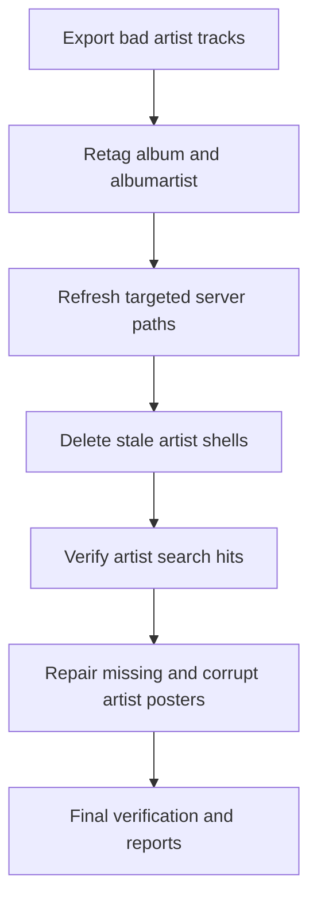
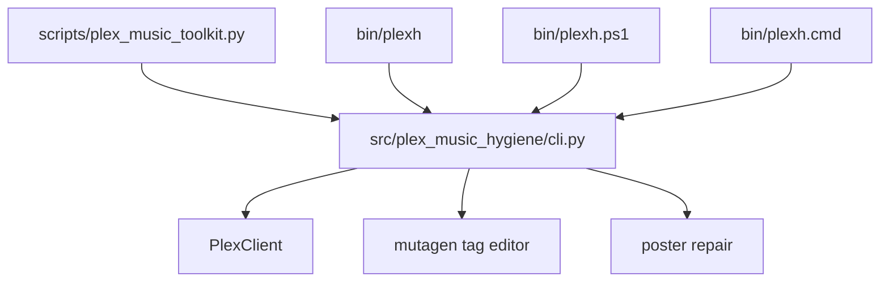

# Architecture

## High Level
```mermaid
flowchart LR
  U[Operator] --> C[plexh CLI]
  C --> T[Tag Engine (mutagen)]
  C --> A[Server Adapter]
  T --> F[Music Files]
  A --> P[Plex API (Implemented)]
  A --> J[Jellyfin API (Planned)]
  A --> E[Emby API (Planned)]
  C --> R[Reports CSV]
```

## Cleanup Pipeline


## Script Layout

